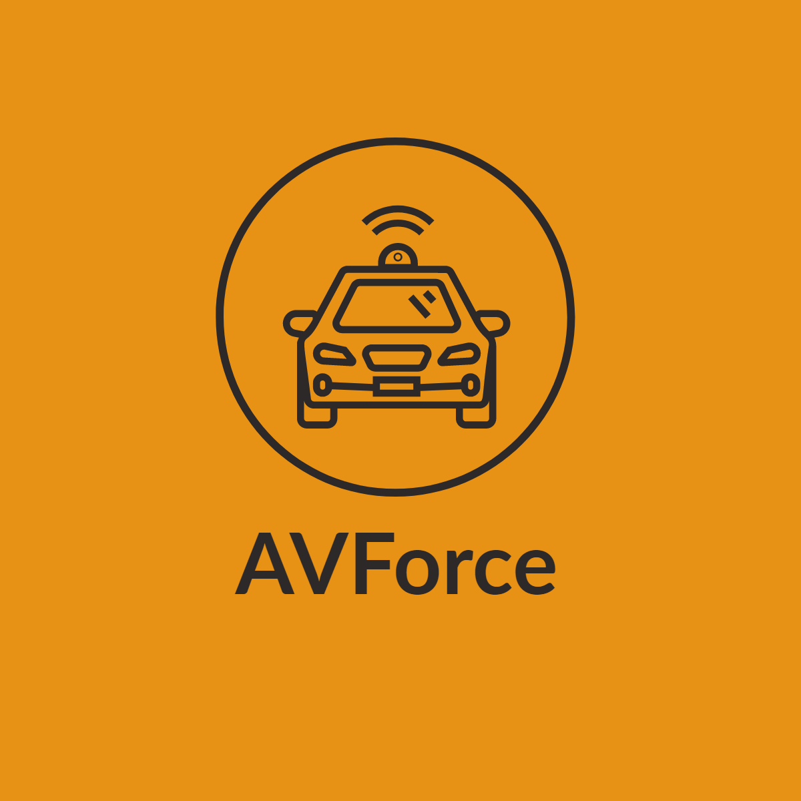
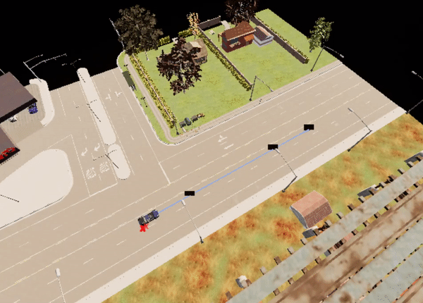
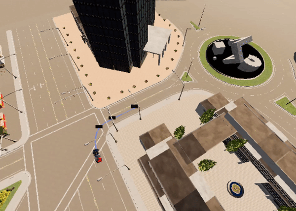
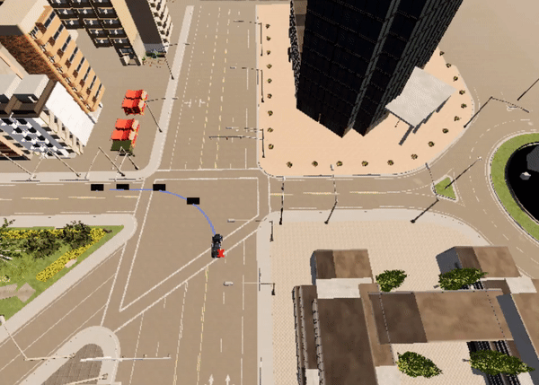
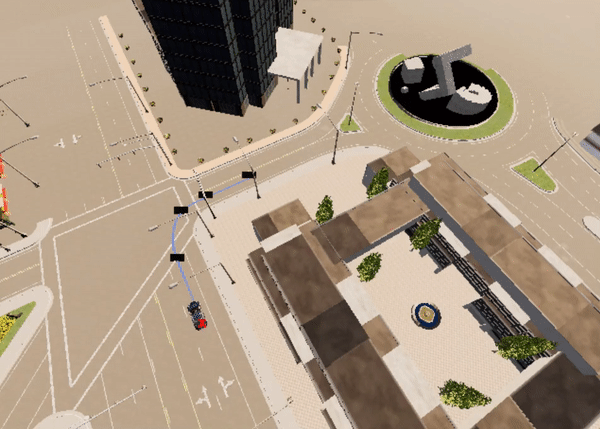
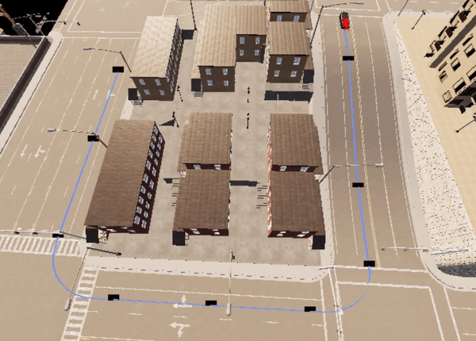

<p align="center">
  
</p>

The goal of this venture is to develop models capable of completing a variety of autonomous tasks within the Carla simulator using reinforcement learning methods.

# A to B
Autonomous ride from point A to B.
Trained models (see A_to_B/final_models) are able to correctly perform fundamental road manoeuvres such as driving straight, turning left and right.
Using this knowledge, the models can learn how to beat different scenarios in a reasonable amount of time, depending on the scenario's complexity.

Examples of some fundamental road manoeuvres:
<p align="left">
  
  
  
  
</p>

Example of a more challenging scenario:
<p align="centre">
  
</p>

## Requirements
* Python 3.7.x
* Pipenv
* Git
* Carla 0.9.10

The pipfile contains a list of all essential project packages. For information on how to install these, see the [setup](#setup) section.

## Setup
1. Install git, python and pipenv
2. Clone this repository and navigate to its root directory
```bash
git clone https://github.com/Michal-Kolomanski/Autonomous-driving-in-Carla
```
3. Install all required project packages by executing
```bash
pipenv install --dev
```

4. To open project virtual environment shell, type:
```bash
pipenv shell
```

## How to run?
1. Provide the paths to the Carla executable and egg files in the file *settings.py*,
2. Run *a2c_rgb.py* file.
